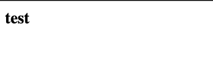
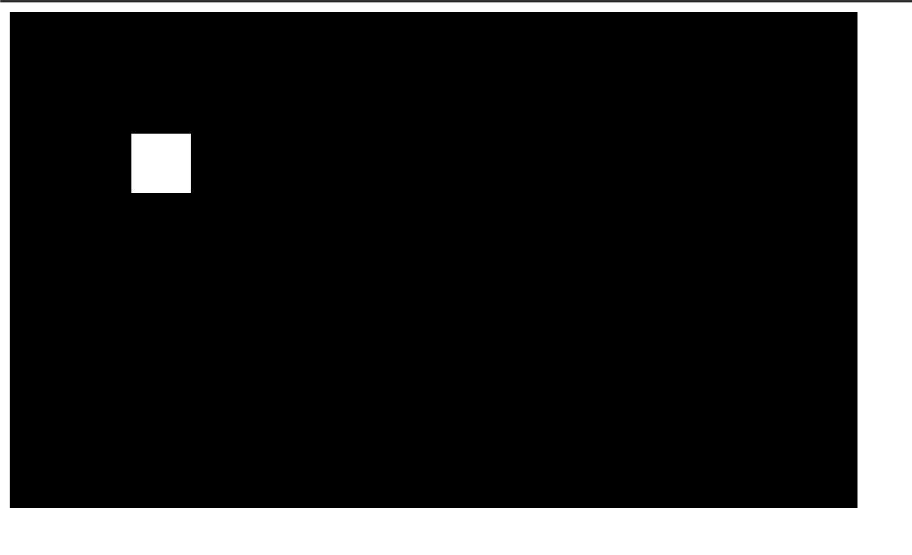
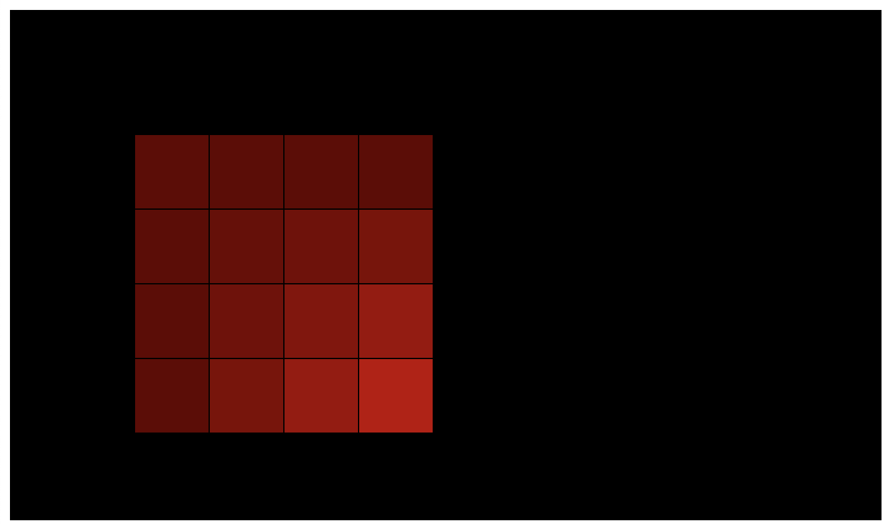
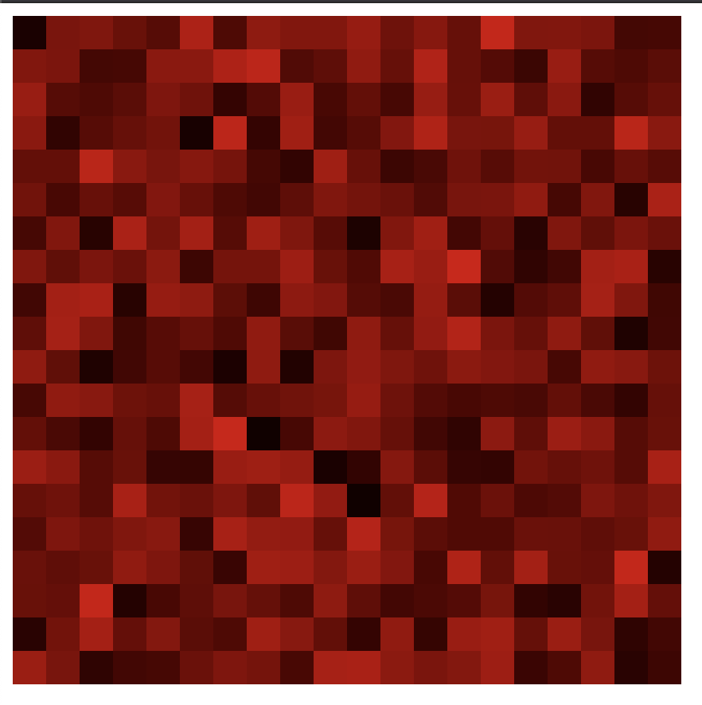

[Photo created with this](https://grid-art.bulkan.dev)

This is part 1 of a two part series.

[p5.js](http://p5js.org/) is already great at being able to be used immedietely, either with the [editor](https://editor.p5js.org/) or loading it in via a 
`<script>` tag to make all functions available globally or in other words on the `window` object.

For more complex projects using a bundler with TypeScript will help with code organisation along with the benefits of having types and modern JavaScript features.

I've been using [Parcel](https://parceljs.org/) for my frontend projects as its mostly a no-config bundler. So lets start by installing it.

```shell
yarn init -y
yarn add parcel-bundler
```

I've used [yarn](https://parceljs.org/getting_started.html) but you can also use `npm`.

With parcel we will need to create an `index.html` file as a entry point which will also load our bundled JavaScript.

```html
<html>
<body>
  <script src="./index.js"></script>
</body>
</html>
```

Also create a `index.js` file next to the `index.html`. Parcel uses the `<script>` tag within the `html` file to find the entry point into the JavaScript. 

```javascript
document.body.innerHTML = '<b>test</b>';
```

To run parcel use the following and then open up the url that parcel will output. Usually `http://localhost:1234`.

```shell
yarn run parcel index.html
```

You should see something like the following which means we have parcel working.



Now onto p5js. If you've ever used p5 before you would highly likely be familiar with the global API in which all the functions are available globally or on the `window` object.

With this approach we will be using what is called the [Instance Mode](https://p5js.org/examples/instance-mode-instantiation.html).

Update your `index.js` file like so;


```javascript
import p5 from 'p5';

let sketch = function(p) {
  let x = 100;
  let y = 100;

  p.setup = function() {
    p.createCanvas(700, 410);
  };

  p.draw = function() {
    p.background(0);
    p.fill(255);
    p.rect(x, y, 50, 50);
  };
};

let myp5 = new p5(sketch);
```

Once you save this file you should notice that parcel development server would've have fetched the required dependencies in this case it should've installed p5.

In addition to the that the page you loaded before should've have reloaded and you should be seeing something like so;



Lastly to convert this into TypeScript first we need to rename the `index.js` to `index.ts` making sure to update the `<script>` tag in the `index.html` file.

Afterwards make sure to restart the development server. Notice again how `parcel` installed typescript? There shouldn't be any visual changes to what is drawn.

Lets create a typed function that redraws the square by dividing it into four smaller squares.

```typescript
import p5 from 'p5';

const sketch = function(p) {
  const CELL_COUNT = 4;

  const rect = (x: number, y: number, width: number, color: p5.Color) => {
    const cellWidth = width / CELL_COUNT; 

    for (let col=0; col<CELL_COUNT; col++) {
      for (let row=0; row<CELL_COUNT; row++) {
        const alpha = p.noise(row, col) * 255;
        color.setAlpha(alpha);
        p.fill(color);
        p.rect(x + cellWidth * row, y + cellWidth * col, cellWidth, cellWidth);
      }
    }
  }

  p.setup = function() {
    p.createCanvas(700, 410);
    p.noLoop();
    p.noStroke();
  };

  p.draw = function() {
    p.background(0);
    const color = p.color('red');
    rect(100, 100, 240, color);
  };
};

const myp5 = new p5(sketch);
```

Notice the new `rect` function? It's a simple way of dividing a square into rows and columns and then drawing a smaller square. I've also updated the alpha value of the color object being passed in which uses [noise](https://www.youtube.com/watch?v=8ZEMLCnn8v0).

You should see the squares look look like the following now.



With this setup you can get fast feedback. For example changing the `CELL_COUNT` to a bigger number like `50` and updating the canvas size and positioning;



That is all for now. You can download a zip file of this [here](./downloads/p5-parcel-typescript.zip).