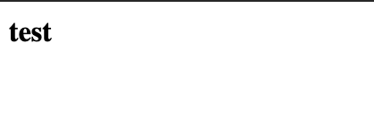
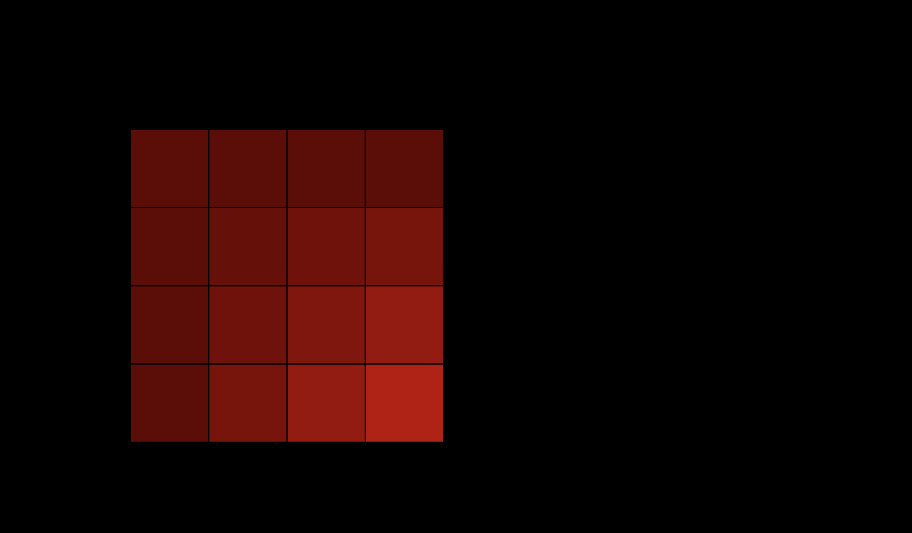
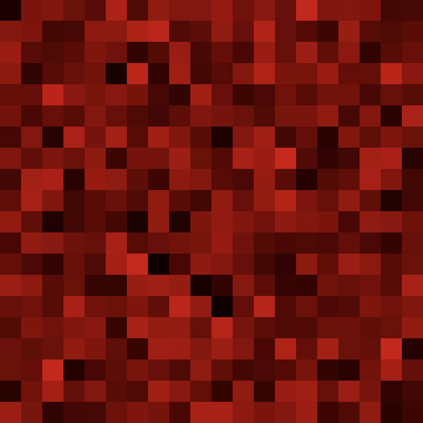

[Photo created by grid-art.bulkan.dev](https://grid-art.bulkan.dev)


This is part one of a two part series and you can read [Part two](/using_vuejs_parceljs_p5js).

[p5.js](http://p5js.org/) is already great at being able to be used immediately either with the [official editor](https://editor.p5js.org/) or loading it in via a 
`<script>` tag from a [cdn](https://cdnjs.com/libraries/p5.js).

For more complex projects I find that using a bundler like [Parcel](https://parceljs.org/) with TypeScript helps with code organisation. 
Not to mention all the benefits of having types and modern JavaScript features.

So lets start by installing [Parcel](https://parceljs.org/) .

```shell
yarn init -y # This just creates a package.json with some defaults.
yarn add parcel --dev
```

I've used [yarn](https://parceljs.org/getting_started.html) here but you can also use `npm`.

With parcel we will first need to create an `index.html` file as a entry point when we run it.

```html
<html>
<body>
  <script type="module" src="./index.js"></script>
</body>
</html>
```

The above also references an `index.js` so create one next to the `index.html`. Parcel uses the `<script>` tag within the `html` file to find the entry point into the JavaScript. 

```javascript
document.body.innerHTML = '<b>test</b>';
```

Don't worry about the contents in the above snippet, we're going to change it soon.

To run parcel use the following and then open up the url that parcel will output.

```shell
yarn run parcel index.html
```

You should see something like the following which means we have parcel working.



Now onto p5js. If you've used p5 or Processing before you will highly likely be familiar with the global API in which all the functions are available globally. In the case of p5 that means it's on the `window` object.

With the following approach we will be using what is called the [Instance Mode](https://p5js.org/examples/instance-mode-instantiation.html).

Update your `index.js` file like so;


```javascript
import p5 from 'p5';

let sketch = function(p) {
  let x = 100;
  let y = 100;

  p.setup = function() {
    p.createCanvas(700, 410);
  };

  p.draw = function() {
    p.background(0);
    p.fill(255);
    p.rect(x, y, 50, 50);
  };
};

let myp5 = new p5(sketch);
```

~~Once you save this file you should notice the parcel development server fetch the required dependencies, in this case it should've installed p5js and updated `package.json`.~~ EDIT (2022-03-17): Parcel 2 doesn't seem to auto install p5 anymore so we will need to intall it via `yarn add p5`

In addition to the that the page you loaded before should've have reloaded and it should look like the following screenshot.


Lastly to convert this into TypeScript first we need to rename the `index.js` to `index.ts` making sure to update the `<script>` tag in the `index.html` file.

~~Afterwards restart the development server. Notice again how `parcel` installed typescript? There shouldn't be any visual changes to what is drawn.~~ EDIT (2022-03-17): [Parcel v2 won't need to autoinstall typescript](https://parceljs.org/languages/typescript/). 

Lets create a typed function that redraws the square by dividing it a grid and use [noise](https://www.youtube.com/watch?v=8ZEMLCnn8v0) to update the alpha value of each "cell".

```typescript
import p5 from 'p5';

const sketch = function(p) {
  const CELL_COUNT = 4;

  const rect = (x: number, y: number, width: number, color: p5.Color) => {
    const cellWidth = width / CELL_COUNT; 

    for (let col=0; col<CELL_COUNT; col++) {
      for (let row=0; row<CELL_COUNT; row++) {
        const alpha = p.noise(row, col) * 255;
        color.setAlpha(alpha);
        p.fill(color);
        p.rect(x + cellWidth * row, y + cellWidth * col, cellWidth, cellWidth);
      }
    }
  }

  p.setup = function() {
    p.createCanvas(700, 410);
    p.noLoop();
    p.noStroke();
  };

  p.draw = function() {
    p.background(0);
    const color = p.color('red');
    rect(100, 100, 240, color);
  };
};

const myp5 = new p5(sketch);
```

Notice the new `rect` function? It's a simple way of dividing a square into rows and columns and then drawing a smaller square.

You should see the squares look like the following now.



With this setup you can get fast feedback. For example changing the `CELL_COUNT` to a bigger number like `50` and updating the canvas size and positioning you can results like this.



That is all for now. You can download a zip file of this [here](./downloads/p5-parcel-typescript.zip).

You can also read [part two here](/using_vuejs_parceljs_p5js).