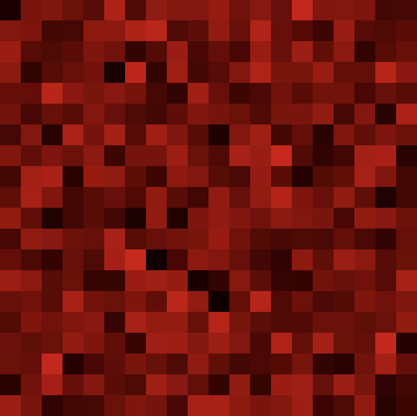

[Photo created by grid-art.bulkan.dev](https://grid-art.bulkan.dev/squiggles?seed=35655&pid=78)

This is part two of a two part series. In [part one](/using_parceljs_typescript_p5js) I showed you how you can setup a project using parcel & TypeScript to create `p5.js` works. I recommend that you should read part one first especially if you’re following along.

Now we’re going to integrate `p5.js` within a Vue component. Why would you want to do something like this? Using a framework like Vue will help you create more complex works with p5.js. You can handle app state in `vue.js` and do routing. I've used this in creating the [hero image]((https://grid-art.bulkan.dev/squiggles?seed=35655&pid=78)) of the title.

First we start off with the same two files as before `index.html` and a `index.ts` but we need to make some changes. First add a new `div` to the `index.html`.

```html
<html>
<body>
  <div id=“app”></div>
  <script src="./index.ts"></script>
</body>
</html>
``` 

Then rename `index.ts` to `art.ts` and update it like so;

```javascript
import p5 from "p5";

const sketch = function(p: p5) {
  const CELL_COUNT = 20;

  const rect = (x: number, y: number, width: number, color: p5.Color) => {
    const cellWidth = width / CELL_COUNT; 

    for (let col=0; col<CELL_COUNT; col++) {
      for (let row=0; row<CELL_COUNT; row++) {
        const alpha = p.noise(row, col) * 255;
        color.setAlpha(alpha);
        p.fill(color);
        p.rect(x + cellWidth * row, y + cellWidth * col, cellWidth, cellWidth);
      }
    }
  }

  p.setup = function() {
    p.createCanvas(420, 420);
    p.noLoop();
    p.noStroke();
  };

  p.draw = function() {
    p.background(0);
    const color = p.color('red');
    rect(0, 0, 420, color);
  };
};

export const makeArt = (node: HTMLElement) => {
  new p5(sketch, node);
}
```

Create a new `index.ts`

```javascript
import Vue from 'vue';

new Vue({
  render: createElement => createElement('h1', 'hello world')
}).$mount('#app');
```

You might need to restart the `parcel` development server and you should notice that it will install vue.

If you navigate to the URL that parcel prints out which is usually http://localhost:1234 you will see the page with a heading reading `hello world`. Nothing fancy but it means things are working.

We now need to create a component to help us wrap the p5.js code. Create a file named `Art.vue` next to `index.ts`; 

```javascript
<template>
  <div ref=“canvasOutlet”></div>
</template>

<script>
import Vue from "vue";
import { makeArt } from "./art.ts";

export default Vue.extend({
  mounted() {
    setTimeout(() => makeArt(this.$refs.canvasOutlet));
  }
});
</script>
```

This is creating a Vue component that just renders a div to be used a `div` to be used as the DOM node to render the canvas into. We pass a reference to this all the way down to the `p5` instantiation.  This is done in the `mounted` lifecycle to make sure the dom is rendered.

We’re not using this component just yet, so lets update `index.ts` and register the component. The updated file should look like;

```javascript
import Vue from 'vue';
import Art from './Art.vue';

new Vue({
  render: createElement => createElement(Art)
}).$mount('#app');
```
You should see the following;



Thats all for this post. Thank you for reading.